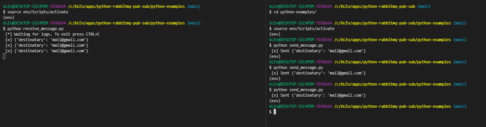

# Python RabbitMQ POC

## Running example

First, you need to load the virtual environment

~~~sh
source env/Scripts/activate
~~~

Then run receive_message.py

~~~sh
python receive_message.py
~~~

Once subscriber is ready, you can start sending messages. Open a new terminal and run send_message.py. Make sure that you activate virtualenv here.

~~~sh
python send_message.py
~~~

This supose to look like this

